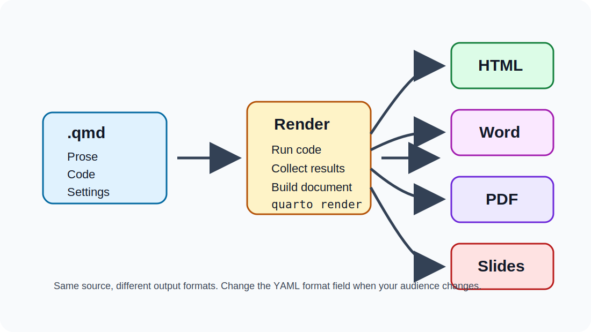
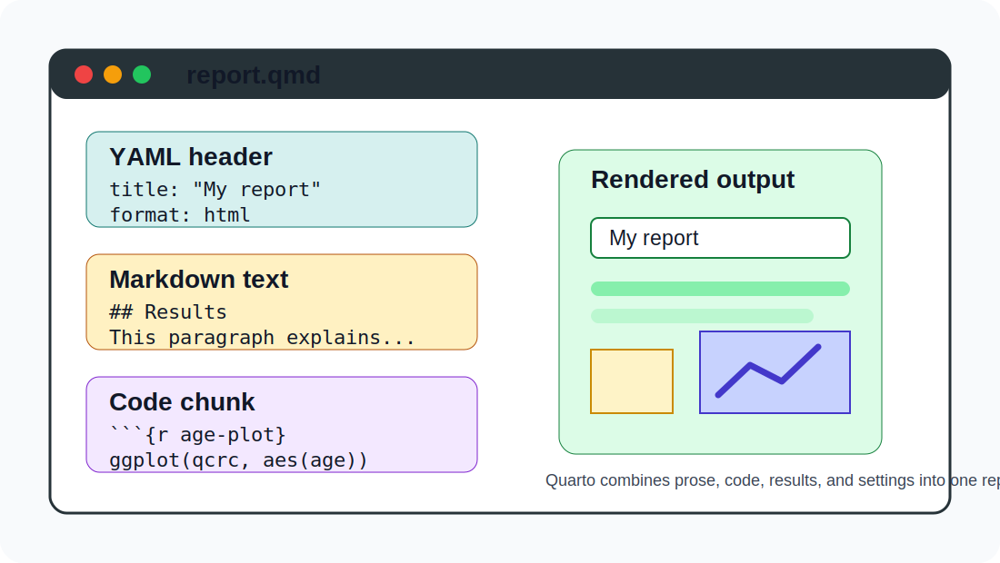
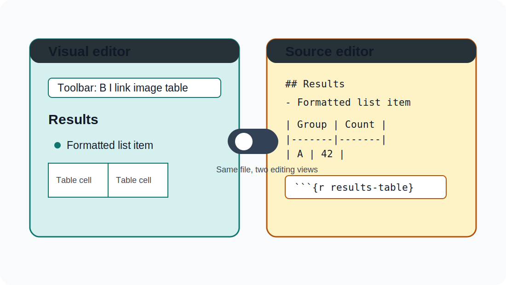
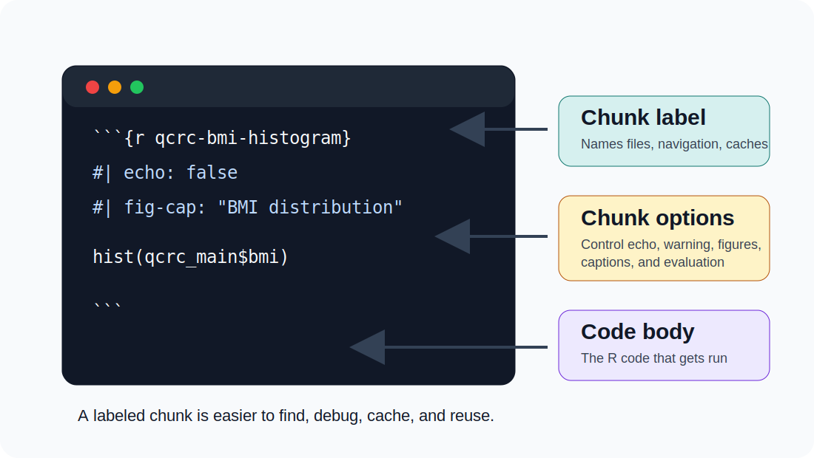

<!-- Graphics in this deck are hand-authored course schematics, not external image assets. -->

## Learning objectives {.unnumbered}

By the end of this module, you should be able to:

- Explain what a Quarto document contains.
- Create and render a basic `.qmd` file.
- Add text, code chunks, chunk labels, options, figures, and tables.
- Use Visual and Source editor modes intentionally.

## What Quarto does {.unnumbered}

Quarto turns one source document into a finished output.

{fig-align="center" width="90%"}

## Why use Quarto? {.unnumbered}

- Reproducible work: code and conclusions live together.
- Communication: readers can focus on results, not just scripts.
- Collaboration: future you can see exactly how the output was made.
- Flexibility: the same source can become HTML, Word, PDF, or slides.

## Where to find help {.unnumbered}

- Main documentation: <https://quarto.org/>
- In RStudio: **Help > Markdown Quick Reference**
- In your own document: render early, render often, and read the first error carefully.

## Quarto document anatomy {.unnumbered}

{fig-align="center" width="92%"}

## Quarto basics {.unnumbered}

Quarto files have a `.qmd` extension.

They usually contain three things:

- A YAML header between `---` lines.
- Markdown text for prose and formatting.
- Code chunks for analysis, tables, and figures.

## Getting started {.unnumbered}

In RStudio or Positron:

1. Choose **File > New File > Quarto Document...**
2. Start with **HTML** output for the first few examples.
3. Click **Render** after each small change.

HTML renders quickly and makes it easy to see what changed.

## Editor modes {.unnumbered}

{fig-align="center" width="92%"}

## Visual editor {.unnumbered}

- Shows formatted headings, lists, tables, links, and images while you edit.
- Lets you insert common elements from menus and toolbar buttons.
- Still saves plain Markdown underneath, so the file remains portable.

## Source editor {.unnumbered}

- Shows the raw Markdown and code.
- Feels closer to writing an R script or R Markdown document.
- Helps when you need to debug Quarto syntax.

## Source editor: common Markdown {.unnumbered .smaller}

````markdown
## Results

This is **bold** text and this is `code`.

- first item
- second item

[Quarto documentation](https://quarto.org/)
````

## Running code in Quarto {.unnumbered}

- Run one chunk with the green arrow on that chunk.
- Run the whole report with **Render**.
- Use the gear next to **Render** to choose where chunk output appears.
- If render fails, fix the first error before moving on.

## Code chunks {.unnumbered}

To insert an R chunk:

1. Use **Insert > Code Chunk**.
2. Or use the shortcut **Ctrl + Alt + I** on Windows/Linux.
3. Or use **Cmd + Option + I** on macOS.

## Chunk labels and options {.unnumbered}

{fig-align="center" width="92%"}

## Chunk labels {.unnumbered}

A useful label is short, unique, and descriptive.

````markdown
{r qcrc-bmi-histogram}
hist(qcrc_main$bmi)
````

Prefer dashes or plain words. Avoid spaces and special characters.

## Why labels help {.unnumbered}

Chunk labels make it easier to:

- Jump to a specific chunk in the editor.
- Find generated figure files later.
- Cache expensive chunks.
- Debug render errors.

Never duplicate a chunk label in the same document.

## Chunk options {.unnumbered}

Chunk options begin with `#|` inside the chunk.

````markdown
{r qcrc-bmi-histogram}
#| echo: false
#| warning: false
#| fig-cap: "BMI distribution in the QCRC sample"

hist(qcrc_main$bmi)
````

## Common chunk options {.unnumbered}

- `eval: false`: show code without running it.
- `echo: false`: run code but hide it in the output.
- `message: false`: hide messages.
- `warning: false`: hide warnings.
- `error: true`: keep rendering after an error.

Use `error: true` sparingly in final reports.

## Inline code {.unnumbered}

Inline code places a result directly into a sentence.

````markdown
The data frame iris has `r nrow(iris)` rows.
````

Rendered result:

> The data frame iris has 150 rows.

## Figures {.unnumbered}

Figures can be:

- Embedded files, such as PNG, JPEG, or SVG.
- Generated by a code chunk.

Use informative captions and alt text when a figure is part of the argument.

## Figure sizing {.unnumbered}

Good defaults keep plots consistent:

- `fig-width: 6`
- `fig-asp: 0.618`
- `out-width: "70%"`
- `fig-align: center`

Adjust `fig-asp` for unusually tall or wide figures.

## Multiple figures {.unnumbered}

To place generated plots in a row, set a layout option:

````markdown
#| layout-ncol: 2
````

For more detail, see Thomas Lin Pedersen's post:

<https://www.tidyverse.org/blog/2020/08/taking-control-of-plot-scaling/>

## Tables {.unnumbered}

Quarto reports can include:

- Markdown tables you type directly.
- Tables generated by R code.
- Styled tables from packages such as `gt` or `gtsummary`.

We will return to tables later in the course.

## YAML header {.unnumbered}

The YAML header controls whole-document settings.

````yaml
---
title: "My report"
format: html
execute:
  warning: false
---
````

Be careful with indentation. YAML is powerful, but picky.

## First-report habit {.unnumbered}

When writing a Quarto report:

1. Start small.
2. Render after each meaningful change.
3. Label chunks as you create them.
4. Keep prose, code, and conclusions close together.
