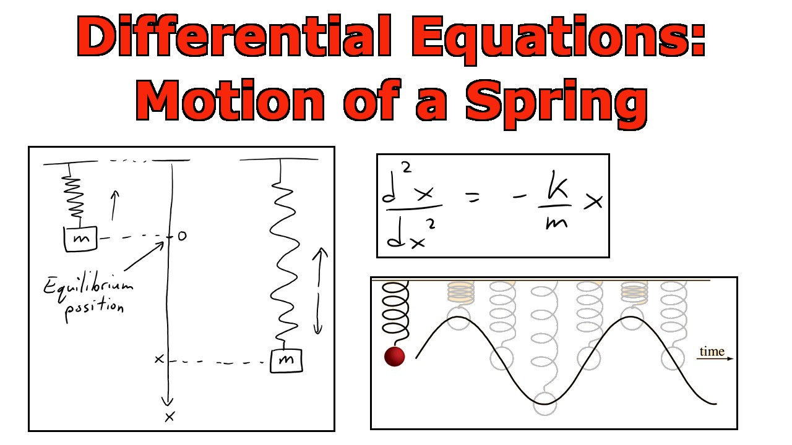

```{r}
#| label: setup
#| include: false

library(deSolve)
```

## Learning goals

By the end of this block, you should be able to:

1. Recognize a differential equation as a way to describe change over time.
1. Read a compartment diagram as a system of ordinary differential equations.
1. Translate the equations into the function shape required by `deSolve`.
1. Solve the model with `deSolve::ode()`.
1. Plot and sanity-check simulated epidemic trajectories.

## Differential equations

A differential equation is an equation with a derivative in it:

$$
\frac{d^2x}{dt^2} + \omega^2 x = 0
$$

- Here `x` is position, `t` is time, and $\omega$ is a constant.

- This equation describes a simple spring or pendulum.

## Why a spring?



Image source: https://www.youtube.com/watch?v=mk2TiR5dwVs

## Spring motion

- Through math magic, we can figure out that the curve traced out by the spring position has to be

$$
f(x) = A\cos(\omega t) + B \sin(\omega t)
$$

- Where $A$ and $B$ are real numbers that are determined by where the spring starts and its initial speed.
- Since we know this, we can make a plot of the spring movement.

The constants `A` and `B` come from the starting position and starting speed.

## Spring motion

```{r}
spring_omega <- 4 * pi
spring_position_0 <- -2
spring_velocity_0 <- 1

spring_times <- seq(0, 2, by = 0.01)

spring_analytical <- data.frame(
  time = spring_times,
  position = spring_position_0 * cos(spring_omega * spring_times) +
    (spring_velocity_0 / spring_omega) * sin(spring_omega * spring_times)
)
```

## Spring motion

```{r}
plot(
  spring_analytical$time, spring_analytical$position,
  type = "l", col = "deepskyblue3", lwd = 2,
  xlab = "Time (seconds)", ylab = "Position",
  main = "Spring movement"
)
abline(h = 0, col = "gray70", lty = 2)
```

## Spring motion: deSolve setup

- So what do we do if we don't know the math magic?
- We use a **numerical solver**. In R, the best one is in the `deSolve` package. These are tools that use good approximations to get the solution.
- The only downside is that we have to write our code in a very specific way.

. . .

- `deSolve` wants *first-order equations*: only first derivatives are allowed.

## Spring motion: deSolve setup

So we rewrite the spring in terms of position and velocity:

$$
\begin{aligned}
\frac{dx}{dt} &= v \\
\frac{dv}{dt} &= -\omega^2 x
\end{aligned}
$$

If you don't understand this, that's ok! We won't have to worry about this substitution in most Epi examples.

## Spring motion: derivative function

- We have to write a function that takes specific arguments in a specific order for `deSolve`.

```{r}
spring_ode <- function(t, state, parameters) {
  position <- state["position"]
  velocity <- state["velocity"]
  omega <- parameters["omega"]

  d_position <- velocity
  d_velocity <- -omega^2 * position

  list(c(position = d_position, velocity = d_velocity))
}
```

## Spring motion: solve

```{r}
spring_initial_state <- c(position = -2, velocity = 1)
spring_parameters <- c(omega = spring_omega)

spring_solution <- deSolve::ode(
  y = spring_initial_state,
  times = spring_times,
  func = spring_ode,
  parms = spring_parameters
)

head(spring_solution)
```

## Spring motion: compare

```{r}
spring_df <- as.data.frame(spring_solution)

plot(
  spring_df$time, spring_df$position,
  type = "l", col = "darkorange2", lwd = 3,
  xlab = "Time (seconds)", ylab = "Position",
  main = "Numerical and exact spring solutions"
)
lines(
  spring_analytical$time, spring_analytical$position,
  col = "deepskyblue3", lty = 2, lwd = 2
)
abline(h = 0, col = "gray70", lty = 2)
legend(
  "topright",
  legend = c("deSolve", "exact"),
  col = c("darkorange2", "deepskyblue3"),
  lty = c(1, 2), lwd = c(3, 2), bty = "n"
)
```

The numerical solution and the exact solution are sitting on top of each other.

## The `deSolve` workflow

`deSolve::ode()` needs four things from you:

1. `y`: the starting state of the system.
1. `times`: the time points where you want results.
1. `func`: a function that calculates the derivatives.
1. `parms`: the model parameters.

```r
deSolve::ode(
  y = initial_state,
  times = time_points,
  func = derivative_function,
  parms = parameters
)
```

## OK, wait a second. {.incremental}

- This is obviously very exciting. But who cares about springs?
- It turns out that for many biological/social processes, it's easier to write down how things change than it is to write down exact formulas.
- And derivatives describe how things change.

## Compartment models {.scrollable}

- If we divide up a population into **states** or **compartments**, usually we can write down how we expect people to move between those compartments.
- For example, consider the famous SIR model.


- You don't need any math magic to write down differential equations from this model, you just need some training on how to read it.

$$
\begin{aligned}
\frac{dS}{dt} &= -\beta I S \\
\frac{dI}{dt} &= \beta I S - \gamma I \\
\frac{dR}{dt} &= \gamma I
\end{aligned}
$$

- It is a true fact about differential equations that most (systems/equations) are impossible to solve via math magic, and we must resort to numerical solutions.
- It is impossible to solve the SIR system analytically with normal math magic, although it is possible using functions you've never heard of.


- We'll walk through this SIR model example.

## Step 1: parameters

For this example:

- `beta`: transmission rate.
- `gamma`: recovery rate.

```{r}
sir_parameters <- c(
  beta = 0.0015,
  gamma = 0.20
)
```

## Step 2: starting state and time

The starting state is a named vector with one value per compartment.

```{r}
sir_initial_state <- c(
  S = 999,
  I = 1,
  R = 0
)

sir_times <- seq(0, 20, by = 0.25)
```

The names matter. They become the column names in the solution.

## Step 3: derivative function

The function signature is always:

```r
function(t, state, parameters) {
  ...
}
```

## Step 3: derivative function

```{r}
sir_ode <- function(t, state, parameters) {
  S <- state["S"]
  I <- state["I"]
  R <- state["R"]

  beta <- parameters["beta"]
  gamma <- parameters["gamma"]

  dS <- -beta * S * I
  dI <- beta * S * I - gamma * I
  dR <- gamma * I

  list(c(S = dS, I = dI, R = dR))
}
```

## Step 4: solve

```{r}
sir_solution <- deSolve::ode(
  y = sir_initial_state,
  times = sir_times,
  func = sir_ode,
  parms = sir_parameters
)

head(sir_solution)
```

`ode()` returns a matrix-like object. The first column is time; the remaining
columns are your compartments.

## Step 5: plot

```{r}
sir_df <- as.data.frame(sir_solution)
sir_colors <- c(S = "deepskyblue3", I = "darkorange2", R = "seagreen4")

matplot(
  sir_df$time, sir_df[, c("S", "I", "R")],
  type = "l", lty = 1, lwd = 2, col = sir_colors,
  xlab = "Time", ylab = "Number of people", main = "SIR model"
)

legend(
  "right", inset = 0.02, legend = names(sir_colors),
  col = sir_colors, lty = 1, lwd = 2, bty = "n"
)
```

## Sanity checks

Before trusting a simulation, ask:

- Are all compartments non-negative?
- Does the total population stay constant if the model has no births or deaths?
- Does the direction of movement match the diagram?
- Does changing one parameter move the curve in the direction you expect?

## Sanity checks: code

```{r}
range(sir_df$S, sir_df$I, sir_df$R)

sir_total <- sir_df$S + sir_df$I + sir_df$R
range(sir_total)
```

## You try it: SIRS

Modify the SIR model so recovered people lose immunity and become susceptible
again. Call the new parameter `zeta`.


## Practice checkpoint: SIRS setup

Use:

```r
sirs_parameters <- c(beta = 0.0015, gamma = 0.20, zeta = 0.02)
sirs_initial_state <- c(S = 999, I = 1, R = 0)
sirs_times <- seq(0, 160, by = 0.25)
```

Plot the result and compare it with the SIR curve.

## Practice checkpoint: hint

The SIRS equations are:

$$
\begin{aligned}
\frac{dS}{dt} &= -\beta S I + \zeta R \\
\frac{dI}{dt} &= \beta S I - \gamma I \\
\frac{dR}{dt} &= \gamma I - \zeta R
\end{aligned}
$$

You only need to change two things:

1. Add `zeta <- parameters["zeta"]`.
1. Add the `zeta * R` flow into `dS` and out of `dR`.

## Practice checkpoint: solution setup

```{r}
sirs_parameters <- c(beta = 0.0015, gamma = 0.20, zeta = 0.02)
sirs_initial_state <- c(S = 999, I = 1, R = 0)
sirs_times <- seq(0, 160, by = 0.25)
```

## Practice checkpoint: solution derivative

```{r}
sirs_ode <- function(t, state, parameters) {
  S <- state["S"]
  I <- state["I"]
  R <- state["R"]

  beta <- parameters["beta"]
  gamma <- parameters["gamma"]
  zeta <- parameters["zeta"]

  dS <- -beta * S * I + zeta * R
  dI <- beta * S * I - gamma * I
  dR <- gamma * I - zeta * R

  list(c(S = dS, I = dI, R = dR))
}
```

## Practice checkpoint: solution solve

```{r}
sirs_solution <- deSolve::ode(
  y = sirs_initial_state,
  times = sirs_times,
  func = sirs_ode,
  parms = sirs_parameters
)

sirs_df <- as.data.frame(sirs_solution)
head(sirs_df)
```

## Practice checkpoint: solution plot {.scrollable}

```{r}
matplot(
  sirs_df$time, sirs_df[, c("S", "I", "R")],
  type = "l", lty = 1, lwd = 2, col = sir_colors,
  xlab = "Time", ylab = "Number of people", main = "SIRS model"
)

legend(
  "right", inset = 0.02, legend = names(sir_colors),
  col = sir_colors, lty = 1, lwd = 2, bty = "n"
)
```

With waning immunity, infection can persist at a low level instead of dying out
after a single epidemic wave.

```{r}
tail(sirs_df)
```


## You try it! (harder): environmental pathogen

**Prompt**

For a faster student or take-home extension, add an environmental pathogen
compartment `P`.


## Optional stretch: equations

Use these equations:

$$
\begin{aligned}
\frac{dS}{dt} &= n - b_I I S - b_P P S - mS \\
\frac{dI}{dt} &= b_I I S + b_P P S - gI - mI \\
\frac{dR}{dt} &= gI - mR \\
\frac{dP}{dt} &= qI - cP
\end{aligned}
$$

## Optional stretch: implementation hints

**Hint**

Add a fourth state named `P`. Your derivative function should return four
values: `dS`, `dI`, `dR`, and `dP`.

**Solution outline**

Start from `sirs_ode()`, add `P <- state["P"]`, add parameters named `n`, `b_I`,
`b_P`, `m`, `g`, `q`, and `c`, then return:

```r
list(c(S = dS, I = dI, R = dR, P = dP))
```

Set `n = 0` and `m = 0` for the first run if you want to focus only on the
environmental transmission path.

## What to keep

The reusable pattern is:

1. Name every state variable.
1. Name every parameter.
1. Write one derivative per state variable.
1. Return the derivatives as `list(c(...))`.
1. Plot first, then interpret.

## More resources

- Andreas Handel's [DSAIRM](https://cran.r-project.org/package=DSAIRM) and
  [DSAIDE](https://cran.r-project.org/package=DSAIDE) packages contain many
  infectious disease model examples.
- Many other SISMID courses go much deeper into mathematical and statistical
  modeling of infectious disease systems.
